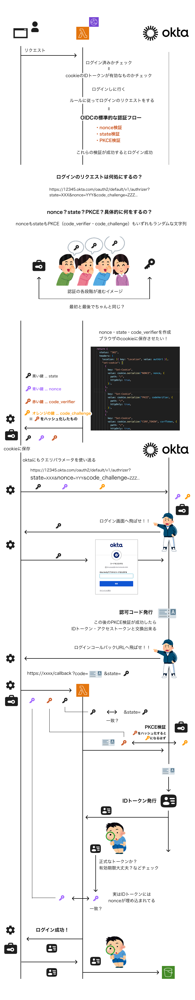

# 認証フロー



# oktaの認可リクエスト（ログイン画面へリダイレクト）

OIDCの標準的な認証フローに従う。ログイン画面に飛ばす際にクエリに、nonce・state・PKCE検証で使う値を付与。

## PKCE

- code_verifier として、43〜128文字のランダムな秘密の文字列を生成（1）
- （1）をクライアント側で保持（あとで照合用に送るため）
- （1）を SHA-256 でハッシュし、Base64URL でエンコードして文字列化（2）
- 認可リクエスト時に、（2）を code_challenge として Okta に送信
- Okta は code_challenge（2）を一時的に保存
- ユーザーがログイン後、クライアントは保存していた（1）を Okta に送信
- Okta は（1）から SHA-256 → Base64URLエンコード を再実行し、（2）と一致するか検証
- 一致すれば、トークン発行（PKCE検証成功）

```js
function redirectToLogin(returnUri) {
  // state ランダムな文字列
  const stateToken = crypto.randomBytes(16).toString("hex");
  // nonce ランダムな文字列
  const nonce = crypto.randomBytes(16).toString("hex");
  // PKCE
  // 1. ランダムな秘密の文字列（クライアント側に保存）
  const codeVerifier = crypto.randomBytes(32).toString("base64url");
  // 2. SHA-256でハッシュ値（バイナリ）作成
  const codeVerifierHash = crypto.createHash("sha256").update(codeVerifier).digest();
  // 3. ハッシュ値をbase64urlに変換。URLで使える文字列に変換
  const codeChallenge = Buffer.from(codeVerifierHash).toString("base64url")
  
  const stateObj = {
    // ユーザーがアクセスしようとしているページのURL
    // 全く必須では無いが認証後にリダイレクトさせるためによく埋められてる
    returnUri,
    // state検証用のランダムな文字列
    stateToken,
  };
  const state = Buffer.from(JSON.stringify(stateObj)).toString("base64url");

  // 認可リクエストのURL
  const authUrl =
    `${OKTA_ISSUER}/v1/authorize?` +
    querystring.stringify({
      client_id: CLIENT_ID,
      response_type: "code",
      scope: "openid email",
      redirect_uri: REDIRECT_URI,
      code_challenge: codeChallenge,
      code_challenge_method: "S256",
      state,
      nonce,
    });

  // ブラウザにcookieをセットした後に authUrl へリダイレクト
  return {
    status: "302",
    headers: {
      location: [{ key: "Location", value: authUrl }],
      // nonce検証するためにブラウザのcookieに保存
      "set-cookie": [
        {
          key: "Set-Cookie",
          value: cookie.serialize("NONCE", nonce, {
            path: "/",
            httpOnly: true,
          }),
        },
        // PKCE検証するためにブラウザのcookieに保存
        {
          key: "Set-Cookie",
          value: cookie.serialize("PKCE", codeVerifier, {
            path: "/",
            httpOnly: true,
          }),
        },
        // state検証するためにブラウザのcookieに保存
        {
          key: "Set-Cookie",
          value: cookie.serialize("STATE", stateToken, {
            path: "/",
            httpOnly: true,
          }),
        },
      ],
    },
  };
}
```

# ログイン成功→コールバックURL

HostedUIでログインするとCloudFrontのURLにリダイレクトされる。再度Lambda@Edgeが実行される。リクエストのURLは/callbackとなってる想定。ここで、state・nonce・PKCE検証を行う。

```js
  // Hosted UIからの戻って来たリクエスト
  if (request.uri.startsWith("/callback")) {
    // Hosted UIでログインするとコールバックURLに色々なクエリが追加される
    const query = new URLSearchParams(request.querystring);

    // Hosted UI（Okta）が発行した一時的な短命のチケット
    // トークンと引き換えれる。引き換え時にPKCE検証が行われる
    const code = query.get("code");

    // 認可リクエスト時にくっつけたクエリが返ってくる。改竄されていないか後でチェック
    const state = query.get("state");

    // クッキーに保存してた nonce を取得
    const nonce = cookies["NONCE"];
    // クッキーに保存してた codeVerifier（秘密の文字列）を取得
    const codeVerifier = cookies["PKCE"];
    // クッキーに保存してた state を取得
    const stateTokenFromCookie = cookies["STATE"];

    if (!code || !state || !nonce || !codeVerifier || !stateTokenFromCookie) {
      return callback(null, redirectToLogin("/"));
    }

    const stateJson = Buffer.from(state, "base64url").toString("utf-8");
    const stateObj = JSON.parse(stateJson);

    // state検証
    if (stateObj.stateToken !== stateTokenFromCookie) {
      console.log("CSRFトークン不一致！");
      return callback(null, redirectToLogin("/"));
    }

    // 元ページに戻るURLを取得
    const returnUri = stateObj.returnUri;

    // 認可コードをトークンに交換
    const tokenRes = await fetch(TOKEN_ENDPOINT, {
      method: "POST",
      headers: { "Content-Type": "application/x-www-form-urlencoded" },
      body: querystring.stringify({
        grant_type: "authorization_code",
        code,
        redirect_uri: REDIRECT_URI,
        client_id: CLIENT_ID,
        code_verifier: codeVerifier,
        client_secret: CLIENT_SECRET,
      }),
    });
    const tokenJson = await tokenRes.json();
    const idToken = tokenJson.id_token;

    if (!cachedJWKS || cachedExpireAt < Date.now()) await fetchJWKS();
    const decoded = jwt.decode(idToken, { complete: true });
    const jwk = cachedJWKS.keys.find((k) => k.kid === decoded.header.kid);
    const pem = jwkToPem(jwk);

    try {
      // 受け取ったトークンを検証
      const verified = jwt.verify(idToken, pem, {
        algorithms: ["RS256"],
        issuer: OKTA_ISSUER,
        audience: CLIENT_ID,
      });

      // nonce検証
      // 認可リクエスト時に送った nonceは idTokne に含まれる
      // クッキーに保存してるものと同じか検証
      if (verified.nonce !== nonce) throw new Error("Nonce mismatch");

      // 問題無ければユーザーが元々アクセスしようとしてページにリダイレクト
      return {
        status: "302",
        headers: {
          location: [{ key: "Location", value: returnUri }],
          "set-cookie": [
            // 以降のリクエストではIDトークンを検証したいのでクッキーに保存
            {
              key: "Set-Cookie",
              value: cookie.serialize("ID_TOKEN", idToken, {
                path: "/",
                httpOnly: true,
                secure: true,
              }),
            },
            // nonce検証に使ってたクッキーを削除
            {
              key: "Set-Cookie",
              value: cookie.serialize("NONCE", "", {
                path: "/",
                expires: new Date(0),
              }),
            },
            // PKCE検証に使ってたクッキーを削除
            {
              key: "Set-Cookie",
              value: cookie.serialize("PKCE", "", {
                path: "/",
                expires: new Date(0),
              }),
            },
            // state検証に使ってたクッキーを削除
            {
              key: "Set-Cookie",
              value: cookie.serialize("STATE", "", {
                path: "/",
                expires: new Date(0),
              }),
            },
          ],
        },
      };

    } catch (err) {
      return callback(null, redirectToLogin("/"));
    }
  }
```

# ログアウト

```js
  if (request.uri.startsWith("/logout")) {
    const idTokenFromCookie = cookies["ID_TOKEN"];
    return {
      status: "302",
      headers: {
        // ログアウトURLにリクエスト
        // 誰がログアウトするのかIDトークンをクエリに付与
        location: [{ key: "Location", value: `${LOGOUT_ENDPOINT}?id_token_hint=${idTokenFromCookie}&post_logout_redirect_uri=${encodeURIComponent(REDIRECT_URI_LOGOUT)}` }],
        "set-cookie": [
          // クッキーに保存してたIDトークンを削除
          {
            key: "Set-Cookie",
            value: cookie.serialize("ID_TOKEN", "", {
              path: "/",
              expires: new Date(0), // 期限切れはブラウザから削除される
              httpOnly: true,
              secure: true,
            }),
          },
        ],
      },
    };
  }
```

# zip（Lambdaアップロードのため）

index.mjsの環境変数を埋める。パラメーターストアを使うとより安全

```
const OKTA_ISSUER = "";
const CLIENT_ID = "";
const CLOUD_FRONT_DOMAIN = "";
const CLIENT_SECRET = "";
```

モジュールのインストール

```
npm install
```

zipする。index.mjsがあるディレクトリで下記コマンドを実行

```
zip -r function.zip index.mjs package.json node_modules
```